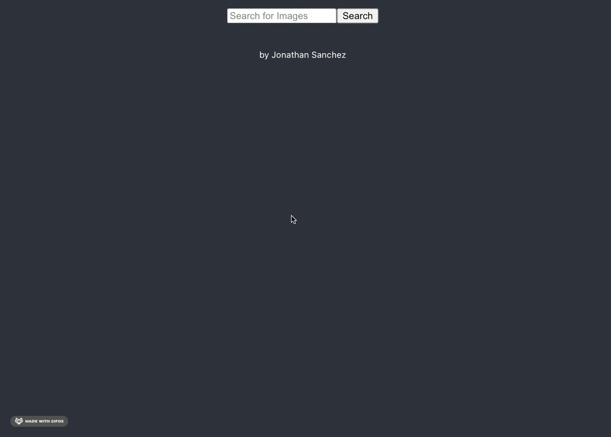

# Image Search Node React App

This project has
1. NODE server running under `/server` directory - on port 3001
2. REACT App on `/client` directory - on port 3000

## To run NODE Server 
on root of the folder `yarn start` will run nodemon for server/index.js

## To run React App
1. `cd client` to move into `/client` folder
2. `yarn start` to start the app
